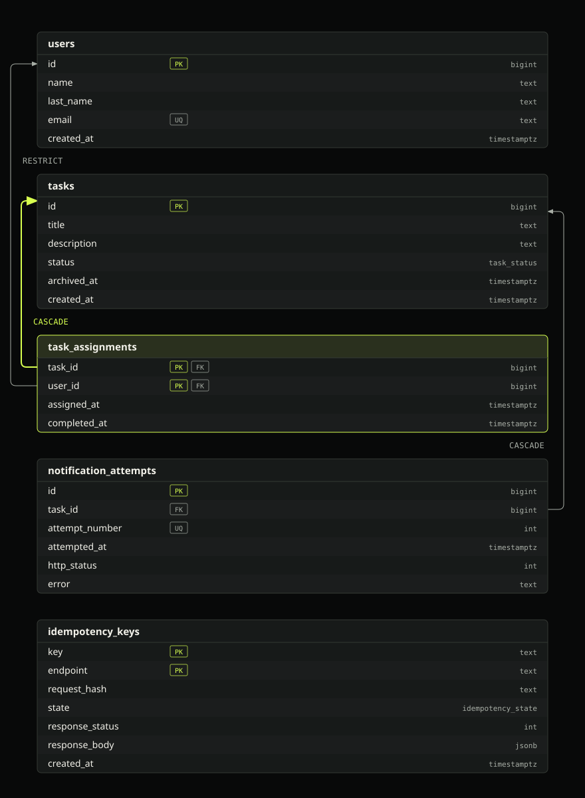
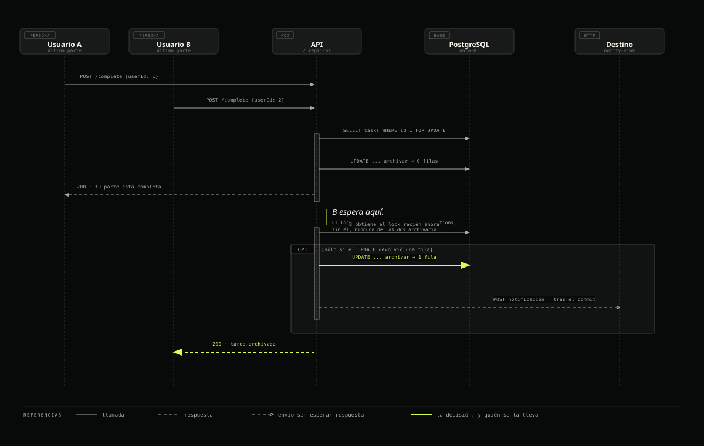
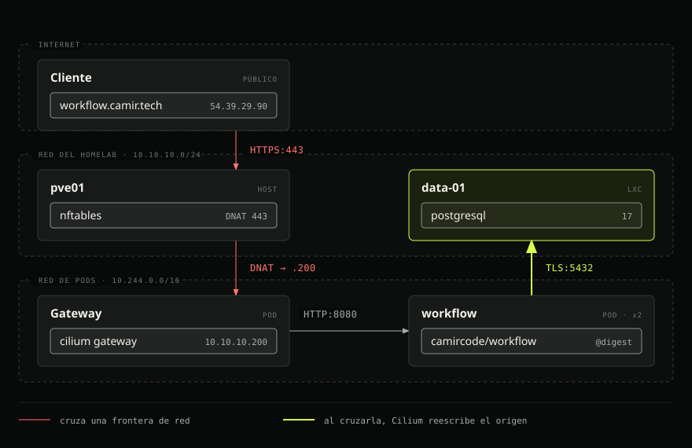

# Workflow API

Gestión de trabajo para equipos. Una tarea se asigna a varias personas, cada una
marca su parte como terminada, y la tarea se archiva cuando termina la última.

**En vivo:** https://workflow.camir.tech · **Documentación:** https://workflow.camir.tech/docs

## Cómo ejecutarlo en local

Requiere Node 24, pnpm y Docker.

```bash
pnpm install
docker run -d --name wf -e POSTGRES_PASSWORD=dev -e POSTGRES_DB=workflow -p 127.0.0.1:5432:5432 postgres:17-alpine
cp .env.example .env          # completar DATABASE_URL y NOTIFY_URL
pnpm db:migrate
pnpm dev
```

`NOTIFY_URL` es obligatoria y no tiene valor por defecto. Si falta, el proceso
no arranca. Puede apuntar a cualquier receptor HTTP; el sistema externo no
necesita existir, porque los intentos quedan registrados en
`GET /tasks/:idTask/notifications` de todos modos.

## Cómo probar la desplegada

Sin credenciales ni cabeceras especiales:

```bash
curl https://workflow.camir.tech/health
curl -XPOST https://workflow.camir.tech/users \
  -H 'content-type: application/json' \
  -d '{"name":"Ada","lastName":"Lovelace","email":"ada@example.com"}'
```

`https://workflow.camir.tech/docs` abre Swagger UI, desde donde se pueden
ejecutar todos los endpoints sin salir del navegador.

## Tests

```bash
pnpm test
```

53 tests contra un PostgreSQL real levantado con Testcontainers, así que necesita
Docker corriendo. Las garantías de concurrencia las hace cumplir la base, y
comprobarlas requiere una base de verdad.

## El modelo de datos



El SQL está en [db/migrations/001_initial.sql](db/migrations/001_initial.sql).
La clave primaria compuesta de `task_assignments` es lo que hace imposible
asignar dos veces a la misma persona, y su columna `completed_at` es la que
decide cuándo se archiva la tarea.

## Decisiones técnicas

### Idempotencia

Cada `POST` acepta la cabecera `Idempotency-Key`. La operación se ejecuta una
vez y las dos respuestas son idénticas, incluso si las peticiones llegan a la
vez.

El mecanismo es un lock consultivo de transacción sobre la clave, tomado antes
de cualquier otra cosa. El segundo llamante espera a que termine la transacción
del primero. Si ésta hizo commit, replica su respuesta guardada; si hizo
rollback, la fila ya no existe y el segundo pasa a ser el dueño de la operación.

Probé antes dos alternativas más simples y ninguna funciona. `INSERT ... ON
CONFLICT DO NOTHING` deja al perdedor sin fila y sin nada que consultar, porque
la del ganador todavía no tiene commit. Añadirle `SELECT ... FOR UPDATE` tampoco
sirve: bajo READ COMMITTED esa fila no es visible, así que no hay nada que
bloquear.

### Archivado exactamente una vez



Cada `complete` toma un lock de fila sobre la tarea, lo que pone las
completions de una misma tarea en orden. Sin ese lock, dos personas terminando
las dos últimas partes a la vez leen cada una el trabajo sin commitear de la
otra como pendiente, y la tarea no se archiva nunca.

Después, un único `UPDATE` condicional decide:

```sql
UPDATE tasks SET status = 'archived', archived_at = now()
 WHERE id = $1 AND status = 'open'
   AND EXISTS     (SELECT 1 FROM task_assignments WHERE task_id = $1)
   AND NOT EXISTS (SELECT 1 FROM task_assignments WHERE task_id = $1 AND completed_at IS NULL)
RETURNING id;
```

Sólo una transacción recibe la fila, y quien la recibe es quien envía la
notificación.

### Notificaciones

Se envían después del commit. Dentro de la transacción, un lock de fila quedaría
tomado durante toda la llamada al servidor externo.

Tres intentos como máximo, con esperas crecientes, cada uno registrado en su
propia transacción. Un 4xx no se reintenta, porque el mismo cuerpo va a recibir
la misma respuesta.

Queda una ventana: si el proceso muere entre el commit del archivado y el primer
intento, nadie envía nada. Una tarea archivada sin ningún intento registrado
identifica ese caso sin ambigüedad, así que el arranque las entrega. Va detrás
de un lock para que dos réplicas no lo hagan las dos.

## La mejora: OpenAPI 3.1 y Swagger UI

En `/docs`, generada desde los mismos esquemas Zod que validan las peticiones.

**Qué problema resuelve.** Esta API tiene comportamiento que no se deduce
mirando sus endpoints: que todo `POST` acepta `Idempotency-Key`, y qué ocurre si
la misma clave llega con cuerpos distintos. Sin documentación, eso se descubre
probando.

**Por qué la consideré necesaria.** Una especificación escrita a mano es una
segunda fuente de verdad que se desincroniza en cuanto alguien cambia un campo y
no la actualiza. Generarla desde los esquemas de validación elimina esa
posibilidad.

**Por qué ésta y no otra.** La alternativa que consideré fueron logs
estructurados y métricas. Ayudan a quien opera el servicio, pero la API se
evalúa contra una URL, y ahí rinde más poder ejercitarla desde el navegador.
Autenticación y rate limiting quedaron descartadas: romperían el acceso sin
credenciales a los endpoints que se evalúan.

## Dónde está desplegada



Sobre un Proxmox propio: tres control planes de Kubernetes, dos workers y
PostgreSQL en un guest aparte.

El reto dice que la forma de despliegue es parte de lo que se evalúa, así que
elegí infraestructura propia en lugar de un PaaS. Permite mostrar entrega por
digest inmutable, GitOps como única vía de escritura al cluster, y secretos que
no pasan por el repositorio.

```
push → Jenkins → test, build, escaneo → GHCR por digest
                                           ↓ Jenkins commitea el digest
                                        camircode/gitops → Argo CD → https://workflow.camir.tech
```

Las imágenes se referencian por digest. La imagen es distroless y declara su
usuario no-root en la imagen. Cada build se escanea y el pipeline falla ante una
vulnerabilidad HIGH o CRITICAL que tenga arreglo disponible, antes de que el
digest llegue a GitOps. `DATABASE_URL` es un Secret renderizado desde Bitwarden
Secrets Manager; la contraseña se genera en la máquina que crea el rol y no la
ve nadie.

El detalle completo está en [docs/DESPLIEGUE.md](docs/DESPLIEGUE.md).

## Supuestos

Donde la especificación no decía:

- Misma `Idempotency-Key` con cuerpo distinto responde 409. Los cuerpos se
  comparan ya validados, así que el orden de las claves y los espacios alrededor
  de un título no cuentan como diferencia.
- La cabecera se acepta, no se exige.
- Completar una parte ya completada devuelve éxito y no vuelve a notificar.
- Asignar a una tarea archivada responde 409.
- `GET /users/:idUser/tasks` responde 404 si el usuario no existe, en lugar de
  una lista vacía.
- Una tarea sin nadie asignado no se archiva.
- Un 4xx del destino de la notificación no se reintenta.
- Los ids viajan como números JSON, no como cadenas.

## Qué quedó fuera por tiempo

Nada de lo que pide el enunciado. Los nueve endpoints, el formato de error, la
idempotencia, el archivado sin duplicados, las notificaciones con reintentos, el
esquema versionado, el UML, los tests y la mejora extra están entregados y
funcionando en la URL pública.
